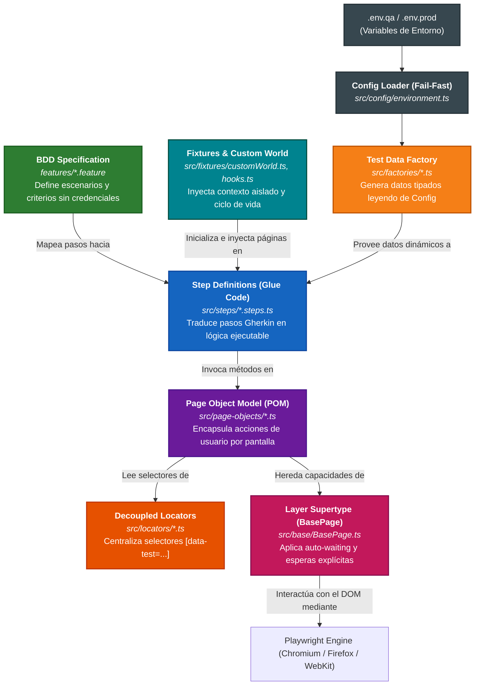

# 📐 Diagramas de Integración, Estructura de Carpetas y Patrones de Diseño
**Proyecto**: Automatización E2E SauceDemo  
**Stack**: Playwright + TypeScript + BDD Cucumber + Page Object Model (POM)  

Este documento detalla exhaustivamente la **estructura de carpetas**, los **patrones de diseño de software aplicados**, su **asociación técnica e interdependencia**, el **soporte multi-ambiente (QA / PROD)**, y los **diagramas de flujo e integración** de toda mi arquitectura.

---

## 1. Diagrama de Asociación e Interacción entre Patrones

Muestra la forma en que los patrones se conectan e intercambian responsabilidades durante la automatización:

---

## 2. Matriz de Asociación: Carpeta, Patrón y Responsabilidad

| Carpeta | Patrón de Diseño | Componentes Clave | ¿Cómo se asocia con las demás capas? |
| :--- | :--- | :--- | :--- |
| `features/` | **BDD Specification Pattern** | `01_auth.feature` `02_e2e_purchase.feature` `03_checkout_boundary.feature` | Contiene los casos en Gherkin en español **sin credenciales quemadas**. Es el punto de entrada que Cucumber parsea para ejecutar los `steps/`. |
| `src/steps/` | **Glue Code / Step Definition Pattern** | `auth.steps.ts` `inventory.steps.ts` `cart.steps.ts` `checkout.steps.ts` | Puente entre Gherkin y la lógica técnica. Consume datos de las `factories/` y llama a los métodos de los `page-objects/` usando las instancias de `fixtures/customWorld`. |
| `src/page-objects/` | **Page Object Model (POM)** | `LoginPage.ts` `InventoryPage.ts` `CartPage.ts` `CheckoutPage.ts` | Modela las páginas de la aplicación. **Hereda de `BasePage`** para usar esperas explícitas y **utiliza los selectores de `locators/`**. No contiene aserciones de Cucumber. |
| `src/locators/` | **Decoupled Locators (Separation of Concerns)** | `LoginLocators.ts` `InventoryLocators.ts` `CartLocators.ts` `CheckoutLocators.ts` | Diccionarios puros de selectores basados en atributos de accesibilidad y `data-test`. Si la UI cambia, solo se modifica esta capa. |
| `src/base/` | **Layer Supertype / Wrapper Pattern** | `BasePage.ts` | Clase base abstracta. Contiene wrappers de Playwright (`click`, `fill`, `waitForLocator`, `getText`) implementando **esperas explícitas obligatorias** y eliminando esperas implícitas o sleeps. |
| `src/factories/` | **Factory Method / Data Factory** | `UserFactory.ts` `CheckoutDataFactory.ts` | Fabrica objetos de prueba inmutables y tipados. Soporta usuarios por rol y escenarios de Partición de Equivalencia y Valores Límite. |
| `src/fixtures/` | **Test Fixture & Dependency Injection Pattern** | `customWorld.ts` `hooks.ts` | Gestiona el ciclo de vida (`BeforeAll`, `Before`, `After`, `AfterAll`). Crea un `BrowserContext` nuevo por escenario para **aislamiento total anti-flakiness** y captura trazas/screenshots. |
| `src/config/` | **Fail-Fast Environment Configuration** | `environment.ts` `.env.qa`, `.env.prod.example` | Detecta dinámicamente el ambiente (`QA` o `PROD`), valida que las variables existan en arranque y evita contraseñas en código TypeScript. |
| `src/utils/` | **Cross-Cutting Utilities Pattern** | `logger.ts` `reportGenerator.ts` | Servicios transversales para logging con Winston (rotación de logs) y generación de reportes HTML enriquecidos. |
| `docs/` | **Living Documentation Pattern** | `casos-de-prueba.md` `guion_video.md` | Matriz de trazabilidad, fichas técnicas de diseño de casos, respuestas técnicas y guion de presentación. |
| `.github/` | **Continuous Deployment Quality Gate** | `e2e-tests.yml` | Orquesta la ejecución desatendida en CI (GitHub Actions), evalúa la compuerta de calidad en QA/PROD y publica reportes descargables. |

---

### 🔄 Flujo de Responsabilidades en el POM:

1. **Gherkin (`.feature`)** declara el **QUÉ** se quiere probar en lenguaje natural (*"Cuando el usuario inicia sesión con credenciales válidas"*).
2. **Step Definition (`.steps.ts`)** actúa como el **COORDINADOR**: recibe la llamada, usa los datos de `UserFactory` y le pide al Page Object que ejecute la acción.
3. **Page Object (`.page.ts`)** define el **CÓMO DE NEGOCIO**: sabe que para iniciar sesión se debe llenar el usuario, llenar la clave y hacer clic en el botón de login.
4. **Locators (`.locators.ts`)** provee el **DÓNDE**: tiene la dirección exacta del elemento en el DOM (`[data-test="login-button"]`).
5. **BasePage (`BasePage.ts`)** provee la **INFRAESTRUCTURA Y ESPERAS**: se asegura de que el botón exista, sea visible y esté habilitado antes de hacer el clic real en Playwright.
6. **Logger (`logger.ts`)** provee la **AUDITORÍA**: deja registro en `logs/execution.log` de cada acción realizada.
